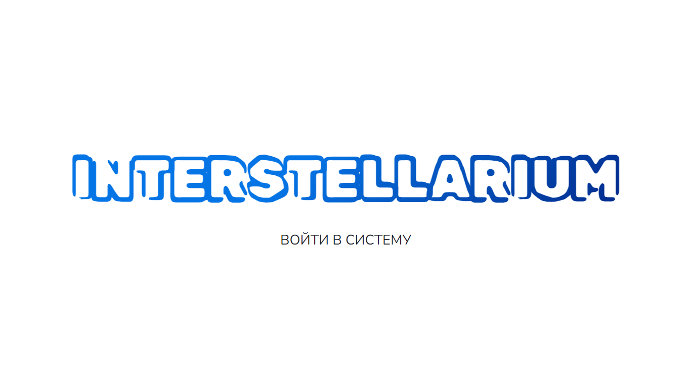
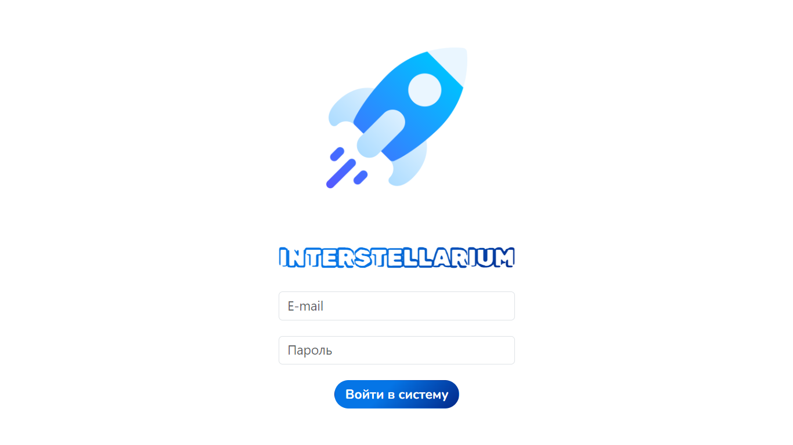

# Interstellarium

## Project installation and launch
#### 1. Clone repository
#### 2. Install Python
You should use Python 3.11.5 or other compatible versions
#### 3. Go to project folder 
#### 4. Install virtual enviroment
#### 5. Install ```requirements.txt```
#### 6. Create ```.env``` file based on ```.env.example```
#### 7. Update database using ```db/migrations```
#### 8. Run application
```commandline
python main.py
```
## Index page

## Login page

